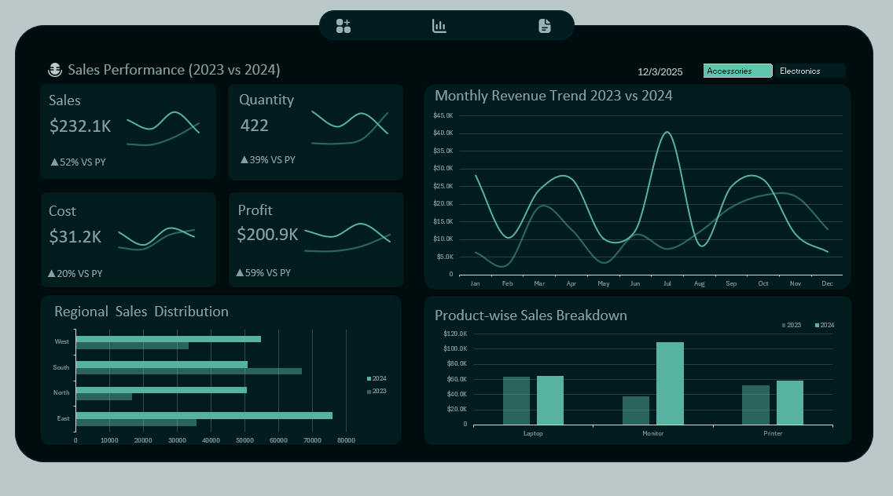

# 📊  Sales Performance Dashboard (Excel)

This repository showcases a fully interactive **Sales Performance Dashboard** built in Microsoft Excel. The project transforms raw sales records into a dynamic analytical tool that helps users monitor essential KPIs, uncover trends, and compare performance using year-over-year (YoY) insights.

The dashboard features a sleek **dark-themed interface** and leverages advanced Excel features such as Pivot Tables, Calculated Fields, Slicers, and automated KPI cards.

---

## ✨ Key Features

### **1. Data Preparation & Engineering**
- Cleaned and standardized raw transaction-level data.
- Added helper columns (Month, Year) to support time-based analysis.

### **2. Data Modeling with Pivot Tables**
- Built multiple Pivot Tables for:
  - Sales  
  - Quantity  
  - Cost  
  - Profit  
  - Region  
  - Product Category  
- Used Calculated Fields to generate additional metrics.

### **3. Financial Metrics & YoY Analysis**
- Added YoY growth calculations using:
  - `GETPIVOTDATA`
  - Time-intelligence formulas
- Computed YoY percentage changes for Sales, Quantity, and Profit.

### **4. Wireframing & Dashboard Design**
- Dashboard layout designed based on modern BI wireframes.
- Adopted a dark color palette for clarity and enhanced visual appeal.
- Focused on data hierarchy, readability, and UX.

### **5. Interactive Dashboard Construction**
- Multi-panel layout with:
  - Line charts (monthly trends)
  - Bar charts (category & region breakdowns)
  - KPI cards with YoY indicators
- Added Slicers for:
  - Category  
  - Year  
  - Region  
- Ensured all visuals are fully interactive and dynamically update based on filters.

---

## 🛠️ Technology Used
- Pivot Tables & Slicers
- Calculated Fields
- Named Ranges- Conditional Formatting
- Formulas: `GETPIVOTDATA`, `IFERROR`, date/time functions

---

## 🚀 How to Use This Dashboard

1. **Download the project**
   - Clone the repository or download **Sales_Dashboard_Final.xlsx**

2. **Open the dashboard**
   - Open the file in Excel.

3. **Interact with the dashboard**
   - Go to the **Dashboard** sheet.
   - Use slicer to filter by Category.
   - Watch charts and KPIs update instantly.
